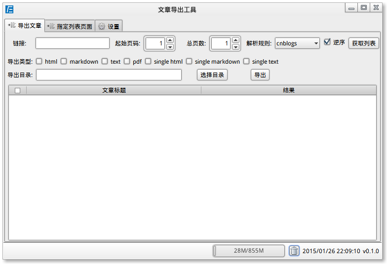

# 文章导出工具

用来导出博客等文章到本地文档，现支持导出到html，txt，markdown，pdf。

## 截屏



## 下载

[百度网盘](http://pan.baidu.com/s/1kTooFD9)
[jre7_x64](http://pan.baidu.com/s/1eQ8HG8E) : 精简jre，可能还存在一些未知问题，最好是安装官方原始版本。

## 使用

首先需要安装jre7及以上版本,可以通过三种方式来配置java路径。

1. 在根目录下创建`env`文件，文件第一行写java的绝对路径，行首和行尾不要出现多余的空格，如`/usr/jre/bin/java`

2. 如果`env`文件不存在，则获取环境变量`JAVA_HOME`的值，(Linux下这个环境变量要在`/etc/environment`文件中配置，如果在其他地方配置，双击打开程序时获取到的`JAVA_HOME`变量将为空。如果在命令行执行`./articles-exporter`就没有这个问题了)。配置示例:`JAVA_HOME=/usr/java/jdk`。此文件夹下java的路径`$JAVA_HOME/bin/java`或`$JAVA_HOME/jre/bin/java`

3. 如果前两种方法都没有获取到java路劲，那么将从`当前路径/jre/bin/java`获取java的路径。

### 命令行运行

```
java -jar articles-exporter.jar -h
usage: articles-exporter [-l string] [-r string] [-s number] [-c number]
                         <-t string> <-o string>
 -c,--page-count <arg>   总页数
 -h,--help               帮助
 -l,--link <arg>         链接，页码使用%s代替，例如：http://example.com/p/%s
 -o,--out <arg>          输出文件夹
 -r,--rule <arg>         规则,位于conf目录下的文件名
 -s,--start-page <arg>   起始页码
 -t,--type <arg>         导出的文件类型，现在支持:[pdf, md, html, stext, text, shtml, smd]使用英文逗号分隔，中间不要有空格
```

### Windows

双击`articles-exporter.exe`即可运行。

### Linux

双击`articles-exporter`即可运行。

修改`articles-exporter.desktop`文件中的Icon、Path、Exec的值，`chmod +x articles-exporter.desktop`，双击`文章导出工具`即可运行。
